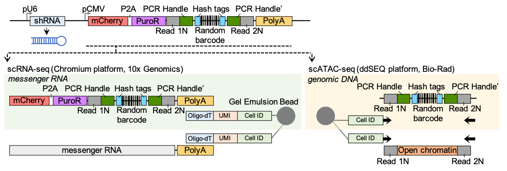

# PseuMO-Tag Decoder
**PseuMO-Tag**: <ins>**Pseu**</ins>do-<ins>**M**</ins>ulti<ins>**O**</ins>mics and cell <ins>**Tag**</ins>ging<br>

The development of this analysis tool is described in the following [preprint](https://doi.org/10.1101/2025.05.24.655549).

**Tutorial By Kenichi Miyata, JFCR**  

---

---

## 0. Setting up the analysis environment
We recommend creating a Conda environment to install the required packages for PseuMO-Tag Decoder.  
After installing and configuring Conda, create an environment for the PseuMO-Tag decoding workflow using the commands below.

```bash
# Create a new Conda environment and install all necessary packages
conda create -n pseumo python=3.7 parallel pigz r-heatmap3 cutadapt starcode fastqc seqkit bowtie2 samtools matplotlib pandas -c bioconda -y

# Install additional tools using Homebrew (for macOS users)
brew install lolcat figlet
```

Now you can run PseuMO-Tag Decoder as long as the `pseumo` environment is activated:

```bash
conda activate pseumo
```

---

## 1. Amplicon-seq (gDNA)
### Directory: `PseuMO-Tag_28bp_v1`
### Step 1) Extraction of PseuMO-Tag barcode sequences (`NNNGTNNNCTNNNAGNNNTGNNNCANNN`)
Extract high-quality and pattern-matched barcodes from Amplicon-seq data. No error correction is performed.  

For example: Only the underlined Ssequences remain.  
`GTCGAGGCAGGAAACAGCTATGACTATGCA`<ins>**NNNGTNNNCTNNNAGNNNTGNNNCANNN**</ins>`TGCATCGTTGAGCAATAA`

Prepare `Fastq/[sampleName]_R1.fastq.gz` and `sample_list.txt` in the current directory.

```bash
conda activate pseumo
bash ${code_dir}/PseuTag_Processor_v2.sh --sampleList sample_list.txt
```

### **Required Arguments**
- `--sampleList` (default: `sample_list.txt`, optional)  
  List of sample names. If the FastQ file name is `20240111Amp-ARI3_S6_R1.fastq.gz`, the sample name should be `20240111Amp-ARI3_S6`.  

```bash
$ tree
.
├── Fastq
│   ├── cont1_S3_R1.fastq.gz
│   └── cont2_S4_R1.fastq.gz
└── sample_list.txt
```
```bash
$ cat sample_list.txt
cont1_S3
cont2_S4
```

### **Options**
- `--help` - Show usage information

---

### Step 2) Create count matrix of PseuMO-Tag barcode sequences
1. Combine multiple PseuTag text files (AFTER running `PseuTag_Processor.sh`).
2. Perform error correction on the merged data across all samples.
3. Create a count matrix for PseuTag barcodes.

```bash
bash ${code_dir}/mtxGenerator/PseuTag_mtxGenerator_v3.sh \
  --sampleList sample_list.txt \
  --resultFile results.csv \
  --analysisDir ${code_dir}/mtxGenerator
```

### **Required Arguments**
- `--sampleList` (default: `sample_list.txt`, optional)  
  List of samples.
- `--resultFile` (default: `results.csv`, optional)  
  Name of the output file. Count matrix (Raw reads) of PseuMO-Tag barcode sequences (rows) per sample (columns)
- `--analysisDir` (default: `/Volumes/Shared/Miyata/Epi_Dry/0.originalCodes_240327/PseuMO-Tag/mtxGenerator`, optional)  
  Directory of analysis scripts.

### **Required Arguments**
- `--sampleList` (default: `sample_list.txt`, optional)  
  List of samples. Same as Step 1.
- `--resultFile` (default: `results.csv`, optional)  
  Name of the output file. The count matrix of PseuMO-Tag barcode sequences (rows) with raw read counts for each sample (columns).
- `--analysisDir` (default: `/Volumes/Shared/Miyata/Epi_Dry/0.originalCodes_240327/PseuMO-Tag/mtxGenerator`, optional)  
  Directory containing analysis scripts.

